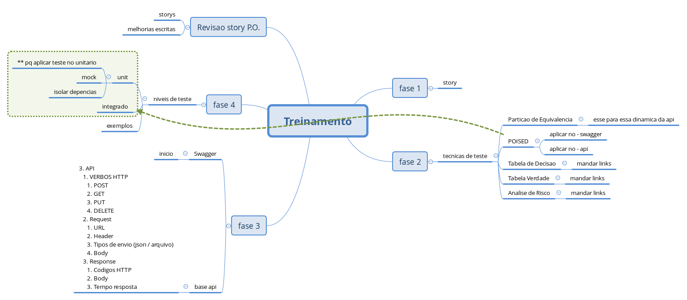

# KT-nivelamento-testes
Repositório com arquivos / apresentações usada no KT de nivelamento de testes backend

## informações

Esse treinamento foi criado para dar nivelar a base e conhecimento sobre vários conceitos que usamos em testes

## tópicos

arquivo abaixo demonstra os dias e tópicos a serem abordados

## pastas

pastas contem arquivos apresentados nos dias...

## link da aplicação criada para o KIT

<https://github.com/diegomedeirosrocha/license-drive-api>
